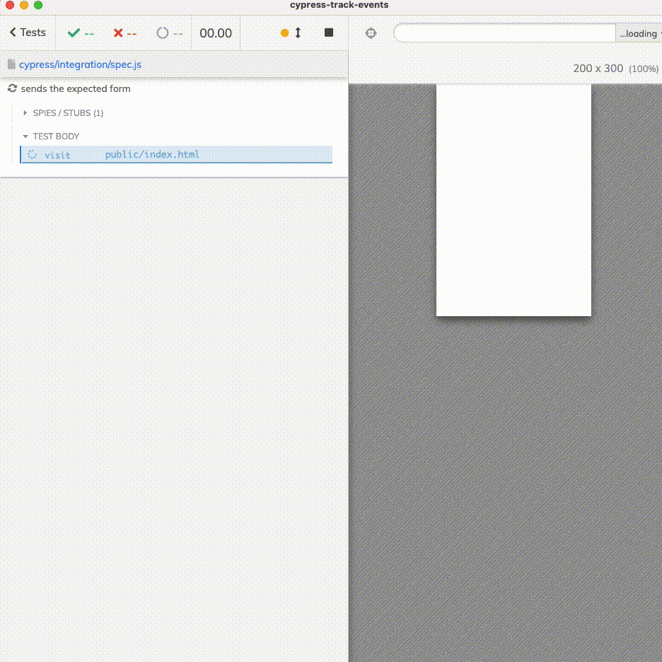

# cypress-track-events

> Send data from the application to Cypress test if needed

Read the blog post [Send Data To The Cypress Test](https://glebbahmutov.com/blog/send-data-to-the-test/)



## Install and test

```
$ npm install
$ npm cypress open
# click on the "spec.js" file
```

See [spec.js](./cypress/integration/spec.js)
